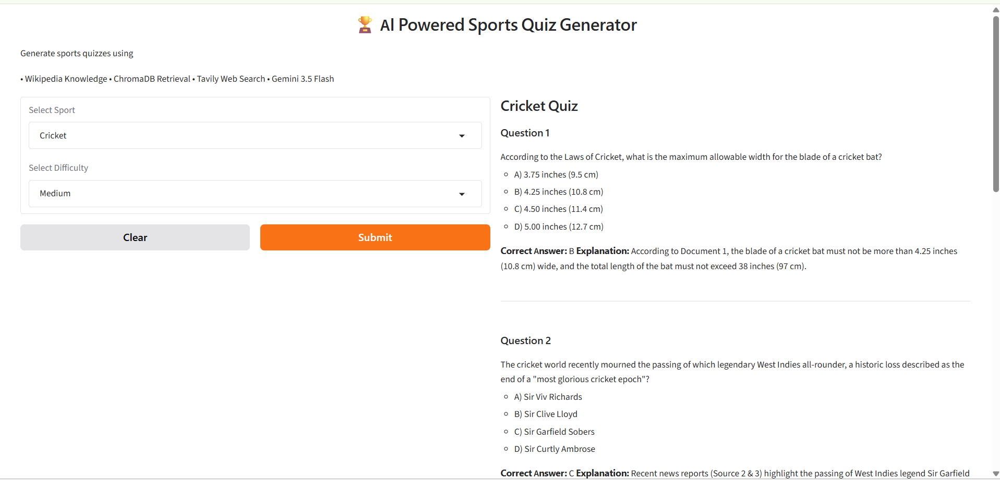

# 🏆 AI Powered Sports Quiz Generator
## 📌 Project Overview

The AI Powered Sports Quiz Generator is a Retrieval-Augmented Generation (RAG) based application that generates high-quality sports quizzes using Artificial Intelligence.

The project combines Wikipedia knowledge stored in ChromaDB with recent sports information retrieved through Tavily Web Search. Google Gemini 3.5 Flash is used to generate multiple-choice quiz questions with answers and explanations.

---

## 🚀 Features

- Sport Selection
- Difficulty Selection (Easy, Medium, Hard)
- Retrieval-Augmented Generation (RAG)
- ChromaDB Vector Database
- Wikipedia Knowledge Base
- Tavily Web Search Integration
- Google Gemini 3.5 Flash
- Interactive Gradio Dashboard
- 5 Multiple Choice Questions
- Correct Answers
- Explanations

---

## 🛠 Technologies Used

- Python
- Google Colab
- ChromaDB
- Sentence Transformers
- Wikipedia API
- Tavily API
- Google Gemini 3.5 Flash
- Gradio

---

## 🏗 Project Architecture

```
                User
                  │
                  ▼
      Select Sport & Difficulty
                  │
                  ▼
         Retrieve Wikipedia Data
          (Stored in ChromaDB)
                  │
                  ▼
        Retrieve Latest Sports News
            (Tavily Search)
                  │
                  ▼
         Combine Both Contexts
                  │
                  ▼
       Google Gemini 3.5 Flash
                  │
                  ▼
         Generate Sports Quiz
```

---

## 📂 Project Workflow

1. Collect sports information from Wikipedia.
2. Clean and split the text into chunks.
3. Generate embeddings using Sentence Transformers.
4. Store embeddings in ChromaDB.
5. Retrieve relevant context based on user input.
6. Search latest sports information using Tavily.
7. Combine retrieved knowledge and web search results.
8. Generate quiz using Gemini 3.5 Flash.
9. Display quiz through Gradio Dashboard.

---

## ⚙ Installation

Install the required libraries:

```bash
pip install chromadb
pip install sentence-transformers
pip install wikipedia-api
pip install tavily-python
pip install google-genai
pip install gradio
```

---

## ▶ How to Run

1. Open the notebook in Google Colab.
2. Run all notebook cells.
3. Enter your Gemini API Key.
4. Enter your Tavily API Key.
5. Launch the Gradio Dashboard.
6. Select a sport.
7. Select difficulty.
8. Click Submit.
9. View the generated quiz.

---

## 📸 Dashboard

The application provides an interactive Gradio interface where users can:

- Select Sport
- Select Difficulty
- Generate Quiz
- View Answers
- View Explanations



---

## 📋 Sample Output

The generated quiz contains:

- 5 Multiple Choice Questions
- Four Options (A, B, C, D)
- Correct Answer for each question
- Brief Explanation for every answer

---

## 📈 Future Improvements

- Score Tracking
- Timer Based Quiz
- More Sports Categories
- User Login
- Leaderboard
- PDF Export
- Voice-based Quiz

---

## 👨‍💻 Author

**Name:** Madhusudhanarao Kampara

AI Powered Sports Quiz Generator using Retrieval-Augmented Generation (RAG), ChromaDB, Tavily Search and Google Gemini 3.5 Flash.
